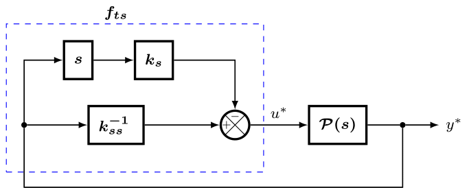

---
template: overrides/main.html
disqus: https-somefunagba-github-io-modernpidcontrolss
---------------------

# Simplified Algorithm for a Modern Implementation of the PID Law
<!-- abstract, summary, tldr, info, todo, tip , hint, important, success, check, done, faq, help, question-->
<!-- warning, attention, failure, error, bug, missing, example, quote, cite-->

!!!abstract "Introduction"
    Although, the concept and theory of the PID is considered established by many, yet still largely misunderstood. 
    It is sometimes rated as a simple and old control algorithm. Quite truly, the overview representation is simple, but its design is not so.    
    
    From the lens of neuroscience and psychology, the PID law is the simplest representation of active inference or perceptual control in nature. 
    The PID law, actively tries to make inference to minimize the deviation of a perceived controllable behaviour from the expected behaviour. 
    
    In systems and control, this law is used as an algorithm for robust feedback control. It infers the necessary control input $u$ to a dynamical system, to reach an achievable expected output $r$ of the dynamical system. 
    This means that the PID law is an artificial intelligence (AI) for inference. It represents the complex intelligence of inference in nature. 
    
    Notably, Nicolai Minorsky, who proposed the seminal theoretical representation of the PID realised this in the early nineties. 
    An important design question is: a general framework for this AI architecture and its parameters for guaranteed stable inference (control).        
    Two main problems in this AI exist. The representation, and the design of AI. Research in the control literature has mostly focused on the latter.

!!!summary "Summary"
    Using modern control and signal processing theory, this library provides for practical use, a simple but robust realization of the PID law represented in critic form.
    The features implemented are compactly listed in the [about](about/about.md) page.
    The problem of automatic design of the PID law for control is approached from the viewpoint of the 'closed PID-loop model'.
    For a more technical understanding of this automatic tuning design, read the preprint at (https://arxiv.org/pdf/2006.00314). Also, please see the [library license](about/license.md) for further details on library use.

## PID Law: Representation
The PID Law can be represented as a critic function: $u = f(r,y)$
$$
u=f(r,y)=\lambda_p\,u_p + \lambda_i\,u_i + \lambda_d\,u_d
$$

<!-- ## Tuning Usecase -->
<!--* `mkdocs new [dir-name]` - Create a new project.-->
<!--* `mkdocs serve` - Start the live-reloading docs server.-->
<!--* `mkdocs build` - Build the documentation site.-->
<!--* `mkdocs -h` - Print help message and exit.-->

## Usecase
The tuning method included in this library as default is the CPLMFC.

The usecase here provides a general overview for the using the library for control. It is divided into three steps. 
The first two steps is to respectively obtain the maximum value of the output to be controlled and 
obtain the discrete-time step the output settles to an average value.
The last step uses information from the last two steps to run the automatic algorithm

See the step illustrations below.


### STEP ONE: IDENTIFY THE MAXIMUM VALUE OF THE OUTPUT TO BE CONTROLLED

<!--  -->

                                               
=== "C++"
``` c++

/*
 *  STEP1: IDENTIFY THE MAXIMUM STEADY STATE OUTPUT OF THE SYSTEM
 *         GIVEN THE MAXIMUM CONTROL INPUT TO THE SYSTEM
 */
#include "Arduino.h"
#include "Wire.h"
#include "Adafruit_MCP4725.h"
#include "Adafruit_MAX31865_library/Adafruit_MAX31865.h"

/* Global Declarations */

/* timings */
int countseq = 0; // take note of this time-step variable
double t_current = 0;
int max_discrete_time_count = 5000; // vary as desired
int dt = 1000; // equivalent to 1 seconds

// set max. control input
const int max_in = 10;

// TODO: initialize other libraries for the DAC and ADC
Adafruit_MCP4725 dac; // Adafruit MCP4725 dac
Adafruit_MAX31865 thermo = Adafruit_MAX31865(10,11,12,13); // Adafruit MAX31865 PT100 adc

void setup() {
    // Turn on Serial Comms.
    // 9600 baud is a compromise setting between easy to kill a runaway process
    // and very slow process
    Serial.begin(9600); // Can Go Up to 2M

    //TODO: setup DAC and ADC
    dac.begin(0x62); // Adafruit MCP4725A1 library
    thermo.readRTD(); // Adafruit MAX31865 library
}

// input and output variables
double in_pwm = 0;
double out_celsius = 0;

void loop() {
    // ensure notion of fixed sampling
    t_current = 0;

    while (countseq >= 0) {
        /* MAX-OUTPUT SYS ID- START */
        /* log the output every dt milli-secs  */
        if ( millis() - t_current >= dt) {
            in_pwm = (4095/10.0)*max_in;
            dac.setVoltage(in_pwm,"false"); // pass in max-input value to dac
            out_celsius = thermo.temperature(100,430.0); // get the output temperature
            t_current = millis();
        }

        // display input_pwm, output_celsius and current discrete-time step.
        // TODO: note down the maximum value
        //  where the out_celsius becomes averagely steady
        Serial.print((String) in_pwm + ", celsius: " + out_celsius +
                    ", countseq: " + countseq);
        Serial.println(F("---\n"));

        if (countseq >= max_discrete_time_count) {
            countseq = -1;
            break;
        }
        countseq++;

    }

}


```

### STEP TWO: CLOSED-LOOP INPUT-OUTPUT SETTLING-TIME

=== "C++"
``` c++
/*
 *  STEP2: IDENTIFY THE CLOSED-LOOP SETTLING-TIME OF THE OUTPUT
 *         GIVEN AN ERROR CONTROL INPUT TO THE SYSTEM
 */
#include "Arduino.h"
#include "Wire.h"
#include "Adafruit_MCP4725.h"
#include <Adafruit_MAX31865_library/Adafruit_MAX31865.h>

/* Global Declarations */

/* timings */
int countseq = 0; // take note of this time-step variable
int max_discrete_time_count = 5000; // vary as desired

double t = 0;
double dt_control = 0.1; // control sampling-time; you can play with this as desired
double t_prev_control = -dt_control;
double dt_sys = 1.0; // equivalent to 1 seconds
double t_prev_sys = -dt_sys;
double t_start = 0;

// set max. control input
const int in_max = 10; // 10V, equivalent to 4095 PWM
// set reference output celsius
double ref_celsius = 0;

// input and output variables
int in_pwm;
double in_val;
double out_celsius = 0;
//TODO: fill with max output celsius value identified in step 1.
double out_celsius_max = 100; // change this to the correct value
// TODO: initialize libraries for the DAC and ADC, if not Adafruit dac and adc
Adafruit_MCP4725 dac; // Adafruit MCP4725 dac
Adafruit_MAX31865 thermo = Adafruit_MAX31865(10,11,12,13); // Adafruit MAX31865 PT100 adc

void setup() {
    // Turn on Serial Comms.
    // 9600 baud is a compromise setting between easy to kill a runaway process
    // and very slow process
    Serial.begin(9600); // Can Go Up to 2M

    //TODO: setup DAC and ADC
    dac.begin(0x62); // Adafruit MCP4725A1 library
    thermo.readRTD(); // Adafruit MAX31865 library

}


void loop() {
    // ensure notion of fixed sampling
    t_start = millis()/1000.0;
    t = t_start;
    while (countseq >= 0) {
        t = t - t_start;
        /* CLOSED-LOOP N_TS SYS ID- START */
        if( t >= (t_prev_control + dt_control) - 0.5*(dt_control)) {
            if (countseq==0) {
                double k = 1; // can vary between 0.5 and 1
                ref_celsius = k*out_celsius_max;
                out_celsius = out_celsius_max;
            }
            in_val = (in_max/out_celsius_max)*(ref_celsius-out_celsius);
            in_pwm = int((4095/10.0)*in_val); // convert input voltage to pwm
            t_prev_control = t;
        }

        dac.setVoltage(in_pwm,"false"); // pass in max-input value to dac

        /* SYSTEM OUTPUT SAMPLING-: EVERY DT_SYS SECONDS*/
        if ( t >= (t_prev_sys + dt_sys)) {
            out_celsius = thermo.temperature(100,430.0); // get the output temperature
            t_prev_sys = t;
        }

        // display input_pwm, output_celsius and current discrete-time step.
        //TODO: note down the countseq value,
        //  where the out_celsius becomes averagely steady.
        //  This value becomes the N_ts value for the PID control tuning algorithm
        Serial.print((String) in_pwm + ", celsius: " + out_celsius +
                ", countseq: " + countseq);
        Serial.println(F("---\n"));

        if (countseq >= max_discrete_time_count) {
            countseq = -1;
            break;
        }
        countseq++;
        t = millis()/1000.0;

    }

}

```

### STEP 3: IMPLEMENT PID CONTROL


  

=== "C++"
``` c++
/*
 *  STEP3: CLOSED-LOOP CONTROL OF THE OUTPUT-TEMPERATURE
 *         USING A PID-CONTROL PWM INPUT TO THE SYSTEM
 */
#include "Arduino.h"

#include "Wire.h"
#include "Adafruit_MCP4725.h"
#include "Adafruit_MAX31865_library/Adafruit_MAX31865.h"

/*PID Library*/
#include "ModernPIDControlSS.h"

/* Global Declarations */

/* timings */
int countseq = 0; // take note of this time-step variable
int max_discrete_time_count = 5000; // vary as desired

double t = 0;
double dt_control = 0.1; // control sampling-time; you can play with this as desired
double dt_sys = 1.0; // equivalent to 1 seconds
double t_prev_sys = -dt_sys;
double t_start = 0;


// set reference output celsius
double ref_celsius = 0;
// input and output variables
int in_pwm;
double in_val;
double out_celsius = 0;

// TODO: initialize other libraries for the DAC and ADC
Adafruit_MCP4725 dac; // Adafruit MCP4725 dac
Adafruit_MAX31865 thermo = Adafruit_MAX31865(10,11,12,13); // Adafruit MAX31865 PT100 adc


/* Parameters PID Structure Config. */
// 10 -> max control input, 0 -> min control input in voltage
PIDNet  PID_I(ref_celsius, out_celsius, dt_control,10, 0);
cplmfc cplmfc_tuner;


void setup() {
    // Turn on Serial Comms.
    // 9600 baud is a compromise setting between easy to kill a runaway process
    // and very slow process
    Serial.begin(9600); // Can Go Up to 2M

    //TODO: setup DAC and ADC
    dac.begin(0x62); // Adafruit MCP4725A1 library
    thermo.readRTD(); // Adafruit MAX31865 library

    /* Parameters PID Structure Config. */
     PID_I.set_bc_follow(0,0,0);

    /* CPLMFC Tuning HyperParameter Config. */
    /* Hyper-Parameter for Kp and Critic Weights */ // for P, I, D
    //TODO: increase alpha steadily to increase fast response;
    //cplmfc_tuner.set_alpha_critics( PID_I, alpha, lambda_i, lambda_p)
    cplmfc_tuner.set_alpha_critics( PID_I,10.0,0.5,0.1);

    /* PID Commonsense Model Config. */
    // note: if the sampling-time is changed
    // rerun the closed-loop settling-time identification
    // to get the correct N_ts and N_tau_l
    // TODO: replace with identified settling-time count from step 2
    int N_ts = 228; // N_ts at 0.1secs;
    // TODO: replace with identified delay-time count
    //  (that is: maximum time-step at which output = 0)
    int N_tau_l = 0;
    //cplmfc_tuner.begin( PID_I, N_ts, N_tau_l);
    cplmfc_tuner.begin( PID_I, N_ts, N_tau_l);

}


void loop() {
    // ensure notion of fixed sampling
    t_start = millis()/1000.0;
    t = t_start;
    while (countseq >= 0) {
        t = t - t_start;
        /* CLOSED-LOOP N_TS SYS ID- START */
        if( t >= ( PID_I.T_prev +  PID_I.Ts) - 0.5*( PID_I.Ts)) {
            PID_kernelOS( PID_I, cplmfc_tuner, t);
            in_val =  PID_I.u;
            in_pwm = int((4095/10.0)*in_val); // convert input voltage to pwm
        }

        dac.setVoltage(in_pwm,"false"); // pass in max-input value to dac

        /* SYSTEM OUTPUT SAMPLING-: EVERY DT_SYS SECONDS*/
        if ( t >= (t_prev_sys + dt_sys)) {
            out_celsius = thermo.temperature(100,430.0); // get the output temperature
             PID_I.y = out_celsius;
            t_prev_sys = t;
        }


        // display input_pwm, output_celsius and current discrete-time step.
        // observe the values
        Serial.print((String) in_pwm + ", celsius: " + out_celsius +
                ", countseq: " + countseq);
        Serial.println(F("---\n"));

        if (countseq >= max_discrete_time_count) {
            countseq = -1;
            break;
        }
        countseq++;
        t = millis()/1000.0;

    }

}
 
```

The identified settling-time is set with this line
```
    ...
    //cplmfc_tuner.begin( PID_I, N_ts, N_tau_l);
    cplmfc_tuner.begin( PID_I, N_ts, N_tau_l);
    ...
```
$N_{ts}$ is the discrete settling-time count. 
$N_{tau_{l}}$ = 0 by default, is the discrete delay-time count when there is no change in output with respect to the input


Tuning performance is varied with this line in the set-up.
```
    ...
    //cplmfc_tuner.set_alpha_critics( PID_I, alpha, lambda_i, lambda_d)
    cplmfc_tuner.set_alpha_critics( PID_I,10.0,0.5,0.1);
    ...
```

It manually configures the main tuner hyper-parameter: $\alpha$, 
and the critic weights: $\lambda_i$ = 0.5 by default and $\lambda_d$ = 0.1 by default

The $\alpha$ constant is meant to gradually increased or reduced till you get a satisfactory response speed

If needed, vary the critic weight $\lambda_i$ to reduce overshoot or reduce steady-state error => min:0, max: 1.0

If needed, reduce the critic weight $\lambda_d$ to reduce oscillatory response, if any => min: 0, max: 1.0

## Notice
Please, this guide is still in a beta state. It will be updated gradually.

!!!faq
    Please, feel free to contact me at oasomefun@futa.edu.ng for any questions or to report any bug.

<!--    mkdocs.yml    # The configuration file.-->
<!--    docs/-->
<!--        index.md  # The documentation homepage.-->
<!--        ...       # Other markdown pages, images and other files.-->


